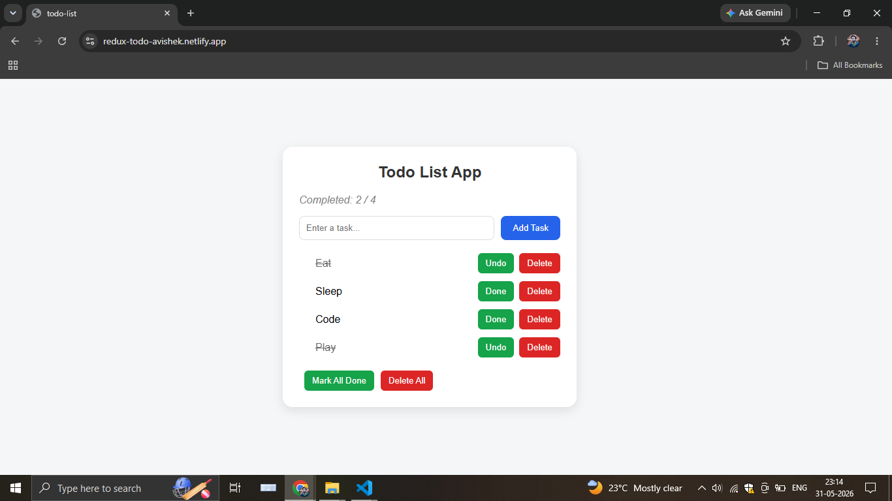

# ✅ Todo List App

A modern and responsive task management application built with React and Redux Toolkit that helps users organize daily tasks efficiently through centralized state management and an intuitive user interface.

---

## Live Demo

https://redux-todo-avishek.netlify.app

---

## Screenshot



---

## Features

* Add new tasks
* Mark tasks as completed or undo completion
* Delete individual tasks
* Mark all tasks as completed with a single click
* Delete all tasks with confirmation
* Dynamic task numbering
* Empty state message when no tasks exist
* Responsive and user-friendly interface
* Centralized state management using Redux Toolkit

---

## Tech Stack

* React.js
* Redux.js
* JavaScript (ES6+)
* HTML5
* CSS3
* Vite
* Netlify

---

## Installation

```bash
git clone https://github.com/AvishekAmin/todo-list.git
cd todo-list
npm install
npm run dev
```

---

## Project Structure

```text
todo-list/
├── src/
│   ├── app/
│   │   └── store.js
│   │
│   ├── components/
│   │   ├── AddForm.jsx
│   │   └── Todo.jsx
│   │
│   ├── features/
│   │   └── todo/
│   │       └── todoSlice.jsx
│   │
│   ├── App.jsx
│   ├── index.css
│   └── main.jsx
│
├── .gitignore
├── eslint.config.js
├── index.html
├── package.json
├── package-lock.json
├── vite.config.js
├── Screenshot.png
└── README.md
```

---

## Redux Concepts Implemented

* Redux Toolkit
* configureStore()
* createSlice()
* Actions and Reducers
* useSelector()
* useDispatch()
* Centralized State Management
* Immutable State Updates with Immer

---

## Author

Avishek Amin

GitHub: https://github.com/AvishekAmin

LinkedIn: https://www.linkedin.com/in/avishekamin

Email: [avishekamin207@gmail.com](mailto:avishekamin207@gmail.com)

---
